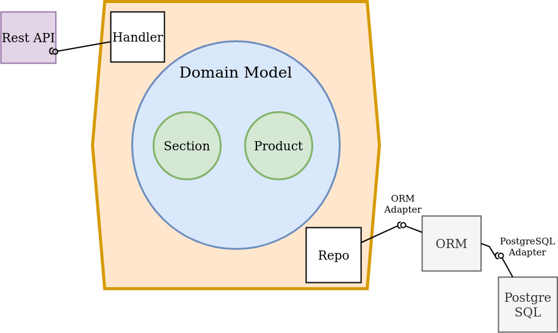

# CRUD app designed with Hexagonal Architecture in Golang

## Application Context Background

Design and build a simple supermarket management API that provides,
- CRUD functionalities for a section (1 section has 0 to N products)
- CRUD functionalities for a product (1 product belong to 1 section)
- a list of paginated products per section

---

## Architecture Design

### Hexagonal Architecture




- Hexagonal Architecture is an architectural style that moves a programmer’s focus from conceptual layers to a distinction between the software’s inside and outside parts. The inside part is use cases and the domain model it’s built upon. The outside part is UI, database, messaging, etc. The connection between the inside and the outside part of an application is realized via ports and their implementation counterparts are called adapters. For this reason, this architectural style is often called Ports and Adapters.
- Hexagonal Architecture promotes the separation of concerns by encapsulating logic in different layers of the application. This enables a higher level of isolation, testability and control over your business specific code. Each layer of the application has a strict set of responsibilities and requirements. This creates clear boundaries as to where certain logic or functionality should sit, and how those layers should interact with each other.
- Each side of the hexagon represents an input – port, for example HTTP, which uses an adapter for the specific type. It makes a clear separation between the domain model and the devices used for inputs and outputs.

## Application Design


## Technologies

- Docker
- Docker compose
- GORM
- PostgreSQL Database
- Fiber web framework
- Testify

---

## Build and run instructions

### Build

```sh
docker-compose -f docker-compose.yml build
```

### Run without background mode

```sh
docker-compose -f docker-compose.yml run
```

---

## OpenAPI Swagger docs

### Generate Swagger docs

```sh
swag init --parseDependency --parseInternal
```

### View OpenAPI Swagger docs

Open brower and navigate to `localhost:8080/swagger/index.html`

---

## Restful API Test

### Get Access Token

```sh
curl 'localhost:8080/api/v1/token/new'
```

### Merchant

#### Get all merchants

```sh
curl -H 'Accept: application/json' -H 'Authorization: Bearer <token>' 'localhost:8080/api/v1/merchant'
```

#### Get 1 merchant

```sh
curl -H 'Accept: application/json' -H 'Authorization: Bearer <token>' 'localhost:8080/api/v1/merchant/<name>'
```

#### Create a merchant

```sh
curl -H 'Accept: application/json' -H 'Authorization: Bearer <token>' -X POST 'localhost:8080/api/v1/merchant/<name>'
```

#### Update a merchant

```sh
curl -H 'Accept: application/json' -H 'Authorization: Bearer <token>' -X PUT 'localhost:8080/api/v1/merchant/<code>/<name>'
```

#### Delete a merchant

```sh
curl -H 'Accept: application/json' -H 'Authorization: Bearer <token>' -X DELETE 'localhost:8080/api/v1/merchant/<code>'
```

### Team Member

#### Get all team members by merchant with pagination

```sh
curl -H 'Accept: application/json' -H 'Authorization: Bearer <token>' 'localhost:8080/api/v1/teammember/merchant/<merchant_code>/<page>/<page_size>'
```

#### Get 1 team member

```sh
curl -H 'Accept: application/json' -H 'Authorization: Bearer <token>' 'localhost:8080/api/v1/teammember/<email>'
```

#### Create a team member

```sh
curl -H 'Accept: application/json' -H 'Authorization: Bearer <token>' -X POST 'localhost:8080/api/v1/teammember/<email>/<name>/<merchant_code>'
```

#### Update a team member

```sh
curl -H 'Accept: application/json' -H 'Authorization: Bearer <token>' -X PUT 'localhost:8080/api/v1/teammember/<email>/<name>'
```

#### Delete a team member

```sh
curl -H 'Accept: application/json' -H 'Authorization: Bearer <token>' -X DELETE 'localhost:8080/api/v1/teammember/<email>'
```